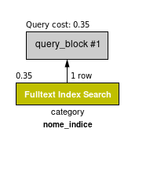
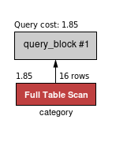
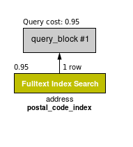
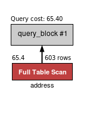

# Transformando ideias em um modelo de banco de dados - Parte 2
## Conteúdo
É importante que você tenha o conhecimento necessário para lidar com os diferentes aspectos da modelagem de dados e tarefas relacionadas. Para se capacitar nesse sentido, você aprenderá a trabalhar com `VIEWs` , **alteração** e **exclusão** de tabelas, além de lidar com a **criação de índices**.

## Objetivo
* Clonar tabelas existentes;
* Lidar com `VIEWs`;
* Alterar tabelas existentes;
* Deletar uma tabela;
* Usar um `INDEX`.

## Exercícios sobre `VIEW`

<details>
  <summary>1. Crie uma view chamada <code>film_with_categories</code> utilizando as tabelas <code>category</code> , <code>film_category</code> e <code>film</code> do banco de dados <code>sakila</code>. Essa view deve exibir o <strong>título do filme</strong>, o <strong>id</strong> da categoria e o <strong>nome</strong> da categoria. Os resultados devem ser ordenados pelo título do filme.</summary>
  
```sql
USE sakila;

CREATE VIEW film_with_categories AS
  SELECT f.title, fc.category_id, c.name
  FROM film AS f
  INNER JOIN film_category AS fc
    ON f.film_id = fc.film_id
  INNER JOIN category AS c
    ON fc.category_id = c.category_id
  ORDER BY f.title;
    
  SELECT * FROM film_with_categories;
```
</details>
<details>
  <summary>2. Crie uma view chamada <code>film_info</code> utilizando as tabelas <code>actor</code> , <code>film_actor</code> e <code>film</code> do banco de dados <code>sakila</code>. Sua view deve exibir o <strong>actor_id</strong> , o nome completo do ator ou da atriz em uma coluna com o <code>ALIAS actor</code> e o título dos filmes. Os resultados devem ser ordenados pelos nomes de atores e atrizes.</summary>
  
```sql
USE sakila;

CREATE VIEW film_info AS
  SELECT
    a.actor_id,
    CONCAT(a.first_name, ' ', a.last_name) AS actor,
    f.title    
  FROM actor AS a
  INNER JOIN film_actor AS fa
    ON a.actor_id = fa.actor_id
  INNER JOIN film AS f
    ON fa.film_id = f.film_id
  ORDER BY actor;
  
SELECT * FROM film_info;
```
</details>
<details>
  <summary>3. Crie uma view chamada <code>address_info</code> que faça uso das tabelas <code>address</code> e city do banco de dados <code>sakila</code>. Sua view deve exibir o <strong>address_id</strong> , o <strong>address</strong> , o <strong>district</strong> , o <strong>city_id</strong> e a <strong>city</strong>. Os resultados devem ser ordenados pelo nome das cidades.</summary>
  
```sql
USE sakila;

CREATE VIEW address_info AS
  SELECT
    a.address_id,
    a.address,
    a.district,
    c.city_id,
    c.city
  FROM address AS a
  INNER JOIN city AS c
    ON a.city_id = c.city_id;
    
SELECT * FROM actor_info;
```
</details>
<details>
  <summary>4. Crie uma view chamada <code>movies_languages</code>, usando as tabelas <code>film</code> e <code>language</code> do banco de dados <code>sakila</code>. Sua view deve exibir o <strong>título do filme</strong> , o <strong>id do idioma</strong> e o <strong>idioma do filme</strong>.</summary>
  
```sql
USE sakila;

CREATE VIEW movies_languages AS
  SELECT f.title, l.language_id, l.name
  FROM film AS f
  INNER JOIN language AS l
    ON f.language_id = l.language_id;

SELECT * FROM movies_languages;
```
</details>

## Exercícios sobre `INDEX`
<details>
  <summary>1. Verifique o impacto de um <code>FULLTEXT INDEX</code> na tabela category (banco de dados sakila ), adicionando-o na coluna name. Após ter adicionado o índice, mensure o custo da query utilizando o execution plan, como já foi feito em lições anteriores. Após ter criado e mensurado o custo da query, exclua o índice e mensure novamente esse custo.</summary>
  
```sql
CREATE FULLTEXT INDEX nome_index ON sakila.category(name);

SELECT *
FROM sakila.category
WHERE MATCH(nome_index) AGAINST('action');

DROP INDEX nome_indice ON sakila.category;

SELECT *
FROM sakila.category
WHERE name LIKE '%action%';
```
<table>
  <tr>
    <th>INDEX</th>
    <th>FULL TABLE SCAN</th>
  </tr>
  <tr>
    <td></td>
    <td></td>
  </tr>
</table>
 
  
</details>
<details>
  <summary>2. Verifique o impacto de um <code>INDEX</code> na tabela address (banco de dados sakila ) adicionando-o na coluna postal_code. Após ter adicionado o índice, mensure o custo da query utilizando o execution plan, como já foi feito em lições anteriores. Após ter criado e mensurado o custo da query, exclua o índice e mensure novamente esse custo.</summary>
  
```sql
CREATE FULLTEXT INDEX postal_code_index ON sakila.address(postal_code);

SELECT *
FROM sakila.address
WHERE MATCH(postal_code) AGAINST('36693');

DROP INDEX postal_code_index ON sakila.address;

SELECT *
FROM sakila.address
WHERE postal_code = '36693';
```
<table>
  <tr>
    <th>INDEX</th>
    <th>FULL TABLE SCAN</th>
  </tr>
  <tr>
    <td></td>
    <td></td>
  </tr>
</table>
</details>

## Exercícios sobre `ALTER TABLE`
<details>
  <summary>1. Escreva uma query SQL para alterar o nome da coluna street_address para address, mantendo o mesmo tipo e tamanho de dados.</summary>
  
```sql
ALTER TABLE hr.locations RENAME COLUMN street_address TO address;
```
</details>
<details>
  <summary>2. Escreva uma query SQL para alterar o nome da coluna region_name para region, mantendo o mesmo tipo e tamanho de dados.</summary>
  
```sql
ALTER TABLE hr.regions RENAME COLUMN region_name TO region;
```
</details>
<details>
  <summary>3. Escreva uma query SQL para alterar o nome da coluna country_name para country, mantendo o mesmo tipo e tamanho de dados.</summary>
  
```sql
ALTER TABLE hr.countries RENAME COLUMN country_name TO country;
```
</details>
